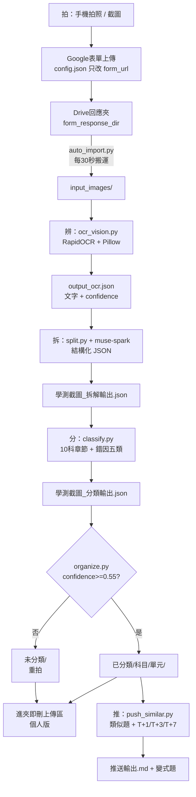
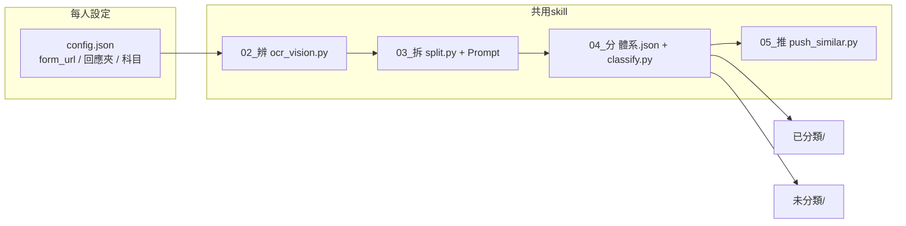

# 流程圖：拍辨拆分推 + 檔案關係

## 總流程

```mermaid
flowchart TD
    A["拍：手機拍照 / 截圖"] --> B["Google表單上傳<br/>config.json 只改 form_url"]
    B --> C["Drive回應夾<br/>form_response_dir"]
    C -- "auto_import.py<br/>每30秒搬運" --> D["input_images/"]
    D --> E["辨：ocr_vision.py<br/>RapidOCR + Pillow"]
    E --> F["output_ocr.json<br/>文字 + confidence"]
    F --> G["拆：split.py + muse-spark<br/>結構化 JSON"]
    G --> H["學測截圖_拆解輸出.json"]
    H --> I["分：classify.py<br/>10科章節 + 錯因五類"]
    I --> J["學測截圖_分類輸出.json"]
    J --> K{"organize.py<br/>confidence>=0.55?"}
    K -- "是" --> L["已分類/科目/單元/"]
    K -- "否" --> M["未分類/<br/>重拍"]
    L --> N["進夾即刪上傳區<br/>個人版"]
    M --> N
    L --> O["推：push_similar.py<br/>類似題 + T+1/T+3/T+7"]
    O --> P["推送輸出.md + 變式題"]
```

## 檔案關係

```mermaid
flowchart LR
    subgraph 共用skill
        S1["02_辨 ocr_vision.py"]
        S2["03_拆 split.py + Prompt"]
        S3["04_分 體系.json + classify.py"]
        S4["05_推 push_similar.py"]
    end
    subgraph 每人設定
        C1["config.json<br/>form_url / 回應夾 / 科目"]
    end
    C1 --> S1
    S1 --> S2 --> S3 --> S4
    S3 --> D1["已分類/"]
    S3 --> D2["未分類/"]
```

## 圖例

- 方框 = 動作或檔案，菱形 = 判斷（信心門檻 0.55）
- `config.json` 是唯一每人要改的檔，其餘共用
- 上傳區三夾（回應夾 / input_images / 收件匣）在 `organize.py` 跑完即刪，只留 `已分類/`、`未分類/`、`分類結果總表.csv`
